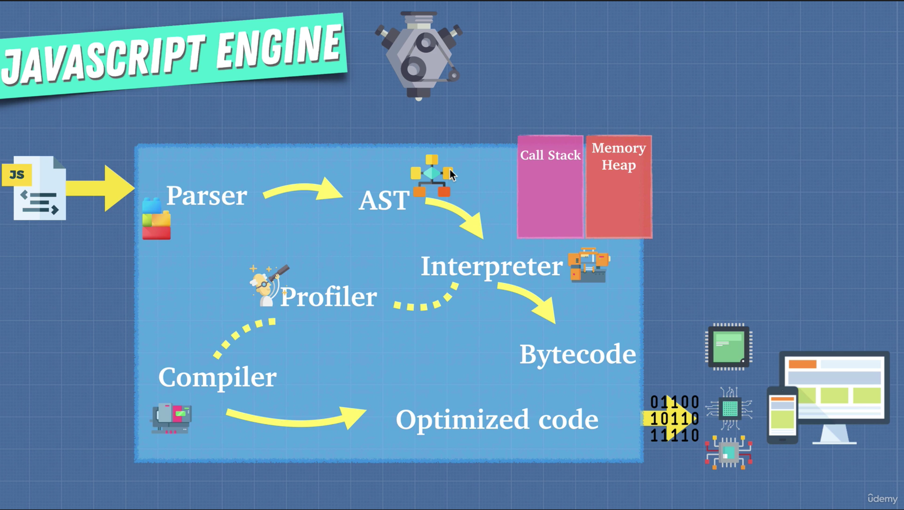

# Learning notes from "Advanced Javascript Concepts" Udemy video:

https://www.udemy.com/course/advanced-javascript-concepts/learn/lecture/13512858?start=15#overview
https://discord.com/channels/423464391791476747/423466983208779776


## How Javascript works:
- computers (the cpu) does not understand javascript.   It only knows ones and zeros.  A javascript engine ("ECMAScript engines" to be precise) is a translator of javascript files for the computer.   There are many ECMAScript engines, including V8 and Chakra.   
	- V8 is written in C++.  Rhino is written in Java.
	- ECMAScript is the governing body of javascript.   Decides how the language should be standardized.  
	- Companies build engines so that more people will use their tools.   For example, Google builds V8 some people use Chrome and the Google search engine & sell more ads

    

    - AST: Abstract Syntax Tree.   This neat tool shows the tree that's generated from a given snipped of js code
    - Interpreter:  Runs the program line by line, on the fly
    - Compiler:  Works ahead of time to produce a translation of the code into a language that can be understood by the machine.    


<br/><br/>
## Interpreters vs Compilers:
- Runs the program on the fly so code can be executed immediately.   The code does not need to be converted into another language.  Because of this an interpreter is a natural fit for Javascript:   a .js file gets sent from the server to the browser, and the javascript can be executed right away, because the user is waiting on the webpage, trying to interact with our application.
- The problem with interpreters is that code can not be optimized.... it just runs line by line.  So code that is run more than once has to be interpreted every time, which can slow down the browser:

```javascript
// even though add() produces the same result every time, the interpreter will run it for every loop.
for(let i=0; i<1000; i++) {
    add(4,5)
} 

// a compiler, however, can translate/optimize it to something like this, which is much faster:
for(let i=0; i<1000; i++) {
    9
}
```
- A compiler needs time to translate the code into another language, but that translated/optimized code runs faster


<br/><br/>
## JIT Compiler (Just In Time)
- The best of both worlds: Interpreter and Compiler combined.    Using the picture above,  first the Interpreter runs the code, which is converted to Bytecode and sent to the machine.   That running code is being watched by a "Profiler" (or "Monitor") who is looking for code that can be optimized (code that is being repeated, for example).   That code is sent to the Compiler (the JIT Compiler), which translates it to Optimized code .  That optimized code is inserted into the Bytecode as it is running, replacing the slower (unoptimized) bytecode.    This means that the execution speed of the javascript code will gradually improve, as the Profiler and Compiler are making updates and changes to the Bytecode.
	- In V8, the JIT compiler is called "Turbofan", and the Interpreter is called "Ignition"


<br/><br/>
## About Bytecode:
A major difference between machine code and bytecode is their type. Machine code is a low-level code while bytecode is an intermediate code. It means that machine code can be directly understood by computers while byte code is produced as intermediate code produced after the source code is compiled.    You need software to execute bytecode (such as a javascript engine, or the JVM for Java).

==> As a javascript programmer you want to write code in a way that helps the compiler make optimizations

Things to watch out for, that might prevent your code from being optimized by the compiler:
- eval()
- arguments
- for in
- with
- delete
- Hidden classes:  https://richardartoul.github.io/jekyll/update/2015/04/26/hidden-classes.html
- Inline caching:  https://github.com/petkaantonov/bluebird/wiki/Optimization-killers#3-managing-arguments


Q:  Why not just use machine code from the beginning?   In other words, why not just compile our javascript beforehand, and send the machine code to the browser, so the client can run faster by not having to do the interpretation and compilation?

A: This would require that browsers agree on a standard executable format, which has not happened as of today (browser wars).   However, WebAssembly is the  binary executable format standard that could change this.  Something to keep an eye on.   Browsers adhering to the WebAssembly standard would remove the need for the javascript engine (interpreter, profiler, compiler)
https://chromestatus.com/feature/5453022515691520
https://developer.mozilla.org/en-US/docs/WebAssembly


<br/><br/>
## Call Stack and Memory Heap:

<br/>

### Memory heap:  
A place to store and write info.  Store our variables, objects, etc.  It allows us to use variables to point to different storage areas.    I guess you can think of variables as a named memory storage area.  

```javascript
const number = 610; // allocate memory for the variable 'number', and make 'number' point to the value 610 (in memory)
const string = 'some string';  // give me memory for 'string', and give it the value 'some string';    When we use 'string', js goes into memory to get it's value.
```


<br/><br/>
### Call stack: 
A place to keep track of where the code is in its execution, so we can run the code in order.   Operates on a "first in, last out" principal.

Javascript has two places where it can remember things.   I never thought of the call stack as a place where things are remembered, so kinda cool:
1. Call stack
2. Memory heap


<br/><br/>
### Stack Overflow:
The call stack grows until the browser can't add anymore.    Easy to reproduce:
```javascript
function inception() {
    inception();
}
```


<br/><br/>
### Garbage collection:
Javascript automatically frees up the memory in the memory heap that we no longer use.   However it's not perfect, and gives js developers a false impression that we do not need to care about memory management.   


<br/><br/>
### Memory leaks:
Memory leaks are pieces of memory that are no longer needed, but has not been garbage collected.  (The memory has no reference, but it still exists)

```javascript
// Global variables
// Global variables consume memory from the global scope, and don't get garbage collected because the global 'program' never ends
var a = 1;
var b = 2;


// Event listeners:
// One of the most common ways to leak memory.  Event listeners are added, but never removed when you don't need them.
// This happens a lot in single page applications, going back and forth between pages, event listeners are being added over and over but never removed
var element = document.getElementById('foo');
element.addEventListener('click', onClick);


// setInterval
// if the interval is never stopped, then the objects that it references never get cleaned up/removed from memory
setInterval(() => {
  // referencing objects
});
```


How to consume all of the memory heap:
```javascript
const arr = [];

for(let i=5; i>1; i++) {
    arr.push(i);
}

// 'arr' keeps on growing forever until all of the heap is consumed, crashing the browser
```


<br/><br/>
### Single Threaded (one thing at a time):
Only one set of instructions is being executed at a time.   It's not doing multiple things at once: it has only one call stack.